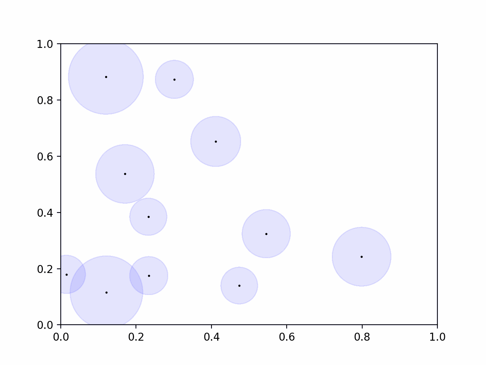

# d-FuzzStream: Dispersion-Based Fuzzy Data Stream Clustering

Implementation of the fuzzy data stream clustering algorithm from the article [d-FuzzStream: A Dispersion-Based Fuzzy Data Stream Clustering](https://ieeexplore.ieee.org/document/8491534).
Translated from [Kotlin](https://github.com/Xicks/d-FuzzStream) (Original) to Python.

> "d-FuzzStream is an adaptation of FuzzStream using the concepts of fuzzy dispersion and fuzzy similarity in order to improve the data summarization while minimizing the complexity of the algorithm."
> -- <cite>Leonardo Schick</cite>
> 
> Extracted from the article

## Demonstration

Summary of the [Bench1_11K](https://raw.githubusercontent.com/CIG-UFSCar/DS_Datasets/master/Synthetic/Non-Stationary/Bench1_11k/Benchmark1_11000.csv) dataset using all default options.



## Requirements

- [Python 3](https://www.python.org/downloads/)

To run examples and generate graphics:
- [Pandas](https://pandas.pydata.org/docs/getting_started/install.html)
- [Matplotlib](https://matplotlib.org/stable/users/installing/index.html)

## How to use it
Create DFuzzStreamSummarizer instance with the following options:
* *min_fmics* (default: 5) -> minimum number of elements in the summary structure.
* *max_fmics* (default: 100) -> maximum number of elements in the summary structure.
* *merge_threshold* (default: 1) -> threshold to dictate whether two summary structures can be merged.
  * value as 1 mean two structures with any overlap can be merged.
  * higher values mean structures with no overlap, but closer to each other, can be merged.
  * lower values mean structures need to overlap more to be merged.
* *radius_factor* (default: 1) -> multiplication factor for summary structures dispersion (radius).
* *m* (default: 2) -> Fuzziness factor (must be different than 1).

All options have default values.

To summarize examples, passes one example at a time to summarizer with its respective timestamp.
```python
from d_fuzzstream import DFuzzStreamSummarizer

summarizer = DFuzzStreamSummarizer()
summarizer.summarize([0,1], 1)
```

**This is not a thread-safe class, no more than 1 example should be passed to summarize method at a time.**

To get a copy of the summary structures call the method:
```
summarizer.summary()
```
Structure can be used later to map to a dataframe. Example:
```
summary = {'x': [], 'y': [], 'weight': []}

for fmic in summarizer.summary():
    summary['x'].append(fmic.center[0])
    summary['y'].append(fmic.center[1])
    summary['weight'].append(fmic.m)
```
## How to run examples
Simple example, without animation:
```commandline
python3 example/example.py
```
Example with animation:
```commandline
python3 example/example_with_animation.py
```
